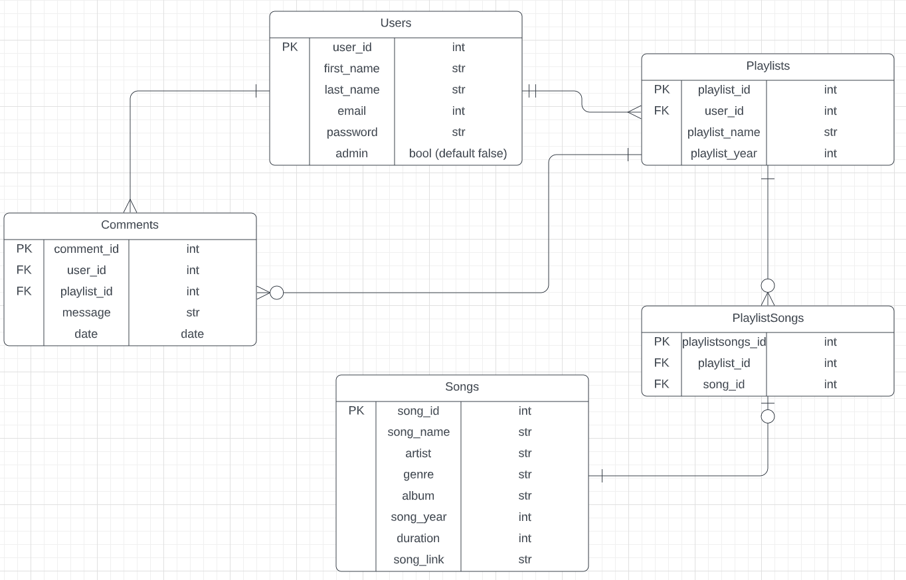

# Song of The Year API - Harry RW 13184

## Identification of the problem you are trying to solve by building this particular app. Why is it a problem that needs solving?
In many forms of entertainment, communities like to come together at the end of each year and discuss what art made an impact over the last 12 months. For avid music listeners it can be a real hassle keeping track of what you listen to, what's worth revisiting and what can be tossed away. So often after these discussions occur one will think "I can't believe I forgot to mention (x, y or z)!". Written notes get damaged or lost, and digitising them ends up with notes spread out over a million different notes apps. By using the Song of The Year API, users can upload the tracks they listen to, add them to unique playlists AND leave comments on other users' playlists to facilitate discussions -  all in one convenient location.

## Why have you chosen this database system. What are the drawbacks compared to others?
I've chosen PostgreSQL as the database managamenet system for this app, and there's many good reasons why. For starters, it's open-source and free to use. PostgreSQL uses familiar SQL syntax and is ACID-compliant, ensuring transactions made within the database are reliable. It also works natively on many of the most popular operating systems used today, and integrates with a huge number of programming languages.

Partly as a consequence of this wealth of features, PostgreSQL is noted as being slower than it's major competitors (such as MySQL) when dealing with large amounts of data. Additionally, as it's open-source there is less incentive to provide the documentation manuals in languages other than English.

## Identify and discuss the key functionalities and benefits of an ORM
An ORM or Object Relational Mapper allows users to manipulate a relational database using object-oriented programming languages, such as Python. It acts as a layer between the server and the database, translating Python functions into queries that can be interpreted by the database. This allows for greater ease of use, minimizing errors and expanding functionality. It allows us to make commands at scale, such as seeding a whole database or creating all our tables in one command, rather than inputting them individually. Many ORMs can also sanitize any queries made, removing the threat of SQL injections. In this project SQLAlchemy has been used as the ORM.

## An ERD for your app

## Detail any third party services that your app will use

## Describe your projects models in terms of the relationships they have with each other

## Discuss the database relations to be implemented in your application

## Describe the way tasks are allocated and tracked in your project

## Document all endpoints for your API

### Users LOGIN
*/auth/login*

**Method**: POST

**Required data**: "email" and "password" as raw JSON

**Response**: Email, authorization token, and is_admin (True or False)

### Users REGISTER
*/auth/register*

**Method**: POST

**Required data**: "first_name", "last_name", "email" and "password" as raw JSON

**Response**: "user_id", "first_name", "last_name", "email", "is_admin"

### Users GET
*/auth/users*

**Method**: GET

**Required data**: None

**Response**: User details, playlists and comments

### Users DELETE
*/auth/user_id*

**Method**: DELETE

**Required authentication**: Requires authenticated JSON Web Token 

**Response**: "User x deleted succesfully"

### Playlists GET All
*/playlists/*

**Method**: GET

**Required authentication**: Requires authenticated JSON Web Token

**Response**: List of all playlists, their songs and comments

### Playlists GET 1
*/playlists/playlist_id*

**Method**: GET

**Required authentication**: Requires authenticated JSON Web Token

**Response**: List of 1 playlist, its songs and comments

### Playlists CREATE
*/playlists/create*

**Method**: POST

**Required data**: "playlist_name" and "playlist_year" as raw JSON

**Required authentication**: Requires authenticated JSON Web Token

**Response**: Playlist details and details of user who created it.

### Playlists DELETE
*/playlists/playlist_id*

**Method**: DELETE

**Required authentication**: Requires authenticated JSON Web Token

**Response**: Playlist 'playlist_name' deleted succesfully

### Playlists UPDATE
*/playlists/playlist_id*

**Method**: PUT

**Required authentication**: Requires authenticated JSON Web Token

**Required data**: "playlist_name" and "playlist_year" as raw JSON

**Response**: Playlist with updated details, comments and songs.

### Songs GET
*/songs*

**Method**: GET

**Required authentication**: Requires authenticated JSON Web Token 

**Response**: List of all songs and song details in the database

### Songs GET 1
*/songs/song_id*

**Method**: GET

**Required authentication**: Requires authenticated JSON Web Token 

**Response**: Details of the specified song (name, artist, genre, album, year, duration, link)

### Songs CREATE
*/songs/create*

**Method**: POST

**Required authentication**: Requires authenticated JSON Web Token 

**Required data**: "song_name", "artist", "genre", "album", "song_year", "duration" and "song_link" as raw JSON

**Response**: All details of created song entry

### Songs UPDATE
*/songs/song_id*

**Required authentication**: Requires authenticated JSON Web Token 

**Required data**: One, many or all of the following details as raw JSON: "song_name", "artist", "genre", "album", "song_year", "duration" and "song_link"

**Response**: All details of updated song entry

### Songs DELETE
*/songs/song_id*

**Method**: DELETE

**Required authentication**: Requires authenticated JSON Web Token 

**Response**: Song 'song_name' deleted successfully

### Comments POST
*/playlists/playlist_id/comments*

**Method**: POST

**Required authentication**: Requires authenticated JSON Web Token 

**Required data**: "message" as raw JSON

**Response**: Playlist ID, User ID, Comment ID, message and date of creation.

### Comments DELETE
*/playlists/comments/comment_id*

**Method**:DELETE

**Required authentication**: Requires authenticated JSON Web Token 

**Response**: Comment 'message' deleted successfully

### PlaylistSong POST
*/playlists/playlist_id/song

**Method**: POST

**Required authentication**: Requires authenticated JSON Web Token 

**Required data**:  'song_id' as raw JSON

**Response**: song_id, playlist_id and playlistsongs_id

### PlaylistSong DELETE
*playlists/song/song_id*

**Method**:  DELETE

**Required authentication**: Requires authenticated JSON Web Token 

**Response**: Playlist song 'song_id' deleted successfully